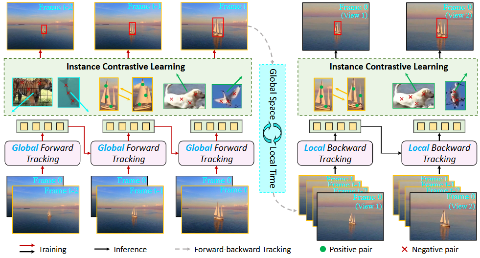

# [AAAI'2025] - SSTrack

The official implementation for the **AAAI 2025** paper \[[_Decoupled Spatio-Temporal Consistency Learning for Self-Supervised Tracking_](https://arxiv.org)\].

[[Models](https://drive.google.com/drive/folders/1BaAKt0e_EOwykd3QHmUvVeazlFjNWUGH?usp=sharing)], [[Raw Results](https://drive.google.com/drive/folders/1BaAKt0e_EOwykd3QHmUvVeazlFjNWUGH?usp=sharing)]]


## Highlights

### :star2: New Self-Supervised Tracking Framework

<p align="center">
  
</p>

The success of visual tracking has been largely driven by datasets with manual box annotations. However, these box annotations require tremendous human effort, limiting the scale and diversity of existing tracking datasets. In this work, we present a novel Self-Supervised Tracking framework named **SSTrack**, designed to eliminate the need of box annotations. Specifically, a decoupled spatio-temporal consistency training framework is proposed to learn rich target information across timestamps through global spatial localization and local temporal association. This allows for the simulation of appearance and motion variations of instances in real-world scenarios. Furthermore, an instance contrastive loss is designed to learn instance-level correspondences from a multi-view perspective, offering robust instance supervision without additional labels. This new design paradigm enables SSTrack to effectively learn generic tracking representations in a self-supervised manner, while reducing reliance on extensive box annotations. Extensive experiments on nine benchmark datasets demonstrate that SSTrack surpasses SOTA self-supervised tracking methods, achieving an improvement of more than 25.3%, 20.4%, and 14.8% in AUC (AO) score on the GOT10K, LaSOT, TrackingNet datasets, respectively.


### :star2: Strong Performance

| Tracker     | GOT-10K (AO) | LaSOT (AUC) | TrackingNet (AUC) | LaSOT_ext (AUC) | VOT2020 (EAO) | TNL2K (AUC) | OTB(AUC) |
|:-----------:|:------------:|:-----------:|:-----------------:|:-----------:|:-----------:|:-----------:|:-----------:|
| ODTrack-B | 77.0         | 73.1        | 85.1              | 52.4          | 0.581          | 60.9          | 72.3          |
| SSTrack-B256 | 67.1         | 64.8        | 80.1              | 46.2          | 0.458          | 52.1          | 67.9          |
| SSTrack-B384 | 72.4         | 65.9        | 80.4              | 48.5          | 0.503          | 53.8          | 70.5          |


## Install the environment
```
conda create -n sstrack python=3.8
conda activate sstrack
bash install.sh
```


## Data Preparation
Put the tracking datasets in ./data. It should look like:
   ```
   ${PROJECT_ROOT}
    -- data
        -- lasot
            |-- airplane
            |-- basketball
            |-- bear
            ...
        -- got10k
            |-- test
            |-- train
            |-- val
        -- coco
            |-- annotations
            |-- images
        -- trackingnet
            |-- TRAIN_0
            |-- TRAIN_1
            ...
            |-- TRAIN_11
            |-- TEST
   ```


## Set project paths
Run the following command to set paths for this project
```
python tracking/create_default_local_file.py --workspace_dir . --data_dir ./data --save_dir ./output
```
After running this command, you can also modify paths by editing these two files
```
lib/train/admin/local.py  # paths about training
lib/test/evaluation/local.py  # paths about testing
```


## Training
Download pre-trained [DROPMAE ViT-Base weights](https://github.com/jimmy-dq/DropMAE) and put it under `$PROJECT_ROOT$/pretrained_networks`.

```
python tracking/train.py \
--script sstrack --config dropmae_256_150ep \
--save_dir ./output \
--mode multiple --nproc_per_node 2 \
--use_wandb 1
```

Replace `--config` with the desired model config under `experiments/sstrack`.

We use [wandb](https://github.com/wandb/client) to record detailed training logs, in case you don't want to use wandb, set `--use_wandb 0`.


## Test and Evaluation

- LaSOT or other off-line evaluated benchmarks (modify `--dataset` correspondingly)
```
python tracking/test.py sstrack dropmae_256_150ep --dataset lasot --runid 150 --threads 8 --num_gpus 2
python tracking/analysis_results.py # need to modify tracker configs and names
```
- GOT10K-test
```
python tracking/test.py sstrack dropmae_256_got_60ep --dataset got10k_test  --runid 60 --threads 8 --num_gpus 2
python lib/test/utils/transform_got10k.py --tracker_name sstrack --cfg_name dropmae_256_got_60ep_060
```
- TrackingNet
```
python tracking/test.py sstrack baseline --dataset trackingnet  --runid 150 --threads 8 --num_gpus 2
python lib/test/utils/transform_trackingnet.py --tracker_name sstrack --cfg_name dropmae_256_150ep
```

- VOT2020
```
cd external/vot20/    <workspace_dir>
bash exp.sh
```

For OTB and VOT2018 datasets, we use (eval_vot18_otb.sh) [PySOT-toolkit](https://github.com/StrangerZhang/pysot-toolkit) library for performance evaluation.

## Test FLOPs, and Speed
*Note:* The speeds reported in our paper were tested on a single RTX2080Ti GPU.

```
python tracking/profile_model.py --script sstrack --config dropmae_256_150ep
```


## Acknowledgments
* Thanks for the [ODTrack](https://github.com/GXNU-ZhongLab/ODTrack) and [PySOT-toolkit](https://github.com/StrangerZhang/pysot-toolkit) library, which helps us to quickly implement our ideas.


## Citation
If our work is useful for your research, please consider citing:

```Bibtex
@inproceedings{zheng2025decoupled,
  title={Decoupled Spatio-Temporal Consistency Learning for Self-Supervised Tracking},
  author={Zheng, Yaozong and Zhong, Bineng and Liang, Qihua and Li, Ning and Song, Shuxiang},
  booktitle={Proceedings of the AAAI Conference on Artificial Intelligence},
  volume={39},
  number={10},
  pages={10635--10643},
  year={2025}
}
```
